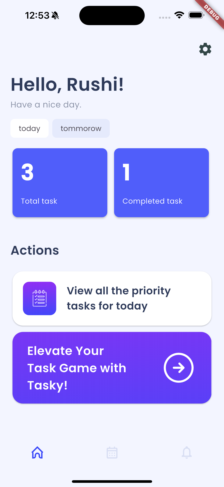
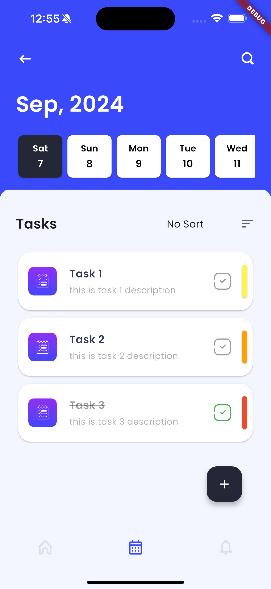
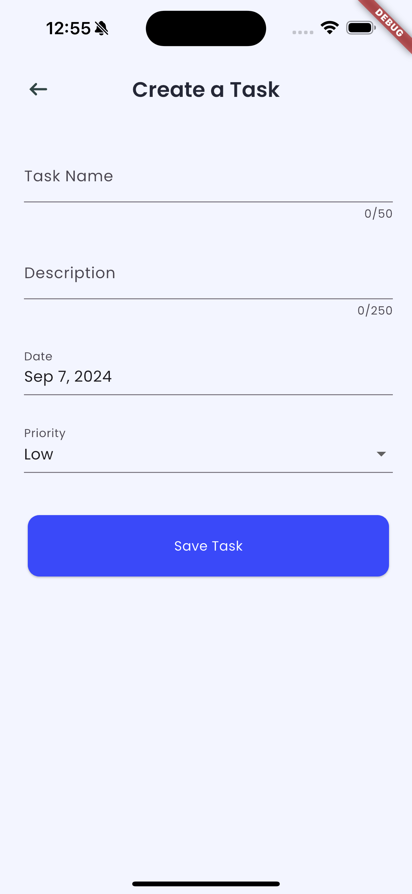
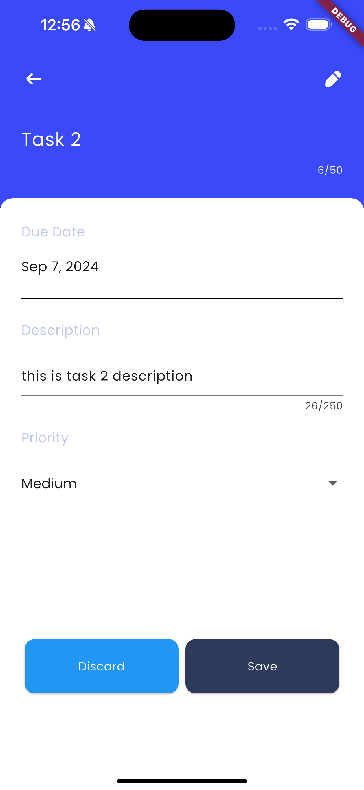
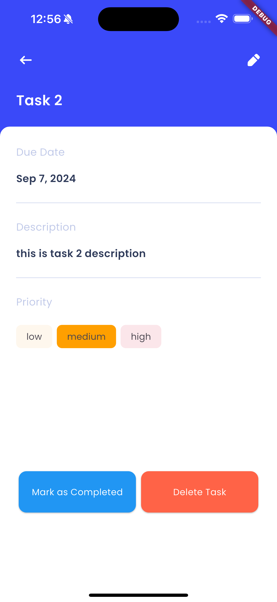

# Task Manager App

## Overview

The Task Manager App is a Flutter-based application built to assist users in efficiently managing
and organizing their tasks. It provides features for creating, modifying, and removing tasks,
sorting them by priority, date, or status, and accessing detailed task information.

## Key Features

- Basic functionalities to add, edit, and delete tasks
- Sort tasks by priority, date, or status
- Intuitive and interactive user interface
- Detailed task view for in-depth information
- Home screen with detailed analytics

## Screenshots

|  |  |
|:-------------------------------------------------:|:---------------------------------------------------:|
|                  **Home Screen**                  |                 **Calendar Screen**                 |

|  |  |
|:------------------------------------------------------:|:------------------------------------------------:|
|                  **Add Task Screen**                   |               **Edit Task Screen**               |

|  |                                                               |
|:----------------------------------------------------:|:-------------------------------------------------------------:|
|                  **Detail Screen**                   |                                                               |

## Getting Started

Follow these instructions to set up and run the app on your local machine.

### Prerequisites

Before you begin, ensure you have the following installed:

- **Flutter SDK** - Required to build and run the app.
- **Android or ios emulator - Required to test and run the app.
- **Dart SDK** - Provides the Dart programming language environment.
- **An IDE** - Such as Visual Studio Code or Android Studio, configured for Flutter development.

### Installation

1. **Clone the Repository**: Open your terminal or command prompt and run:

   ```bash
   git clone https://github.com/developerr7/task-manager
   ```

2. **Navigate to the Project Directory**:

   ```bash
   cd task-manager
   ```

3. **Install Dependencies**: Run the following command to install the necessary dependencies:

   ```bash
   flutter pub get
   ```

4. **Run the App**: To start the application, execute:

   ```bash
   flutter run
   ```

## What's Left to Implement?

- **Local Notifications**: To alert users about upcoming or overdue tasks.
- **Dark Theme**: A dark mode option for better accessibility and user preference.
- **Shared Preferences**: To store user settings and preferences.
- **Enhanced Persistent Storage**: Improved data management and storage.
